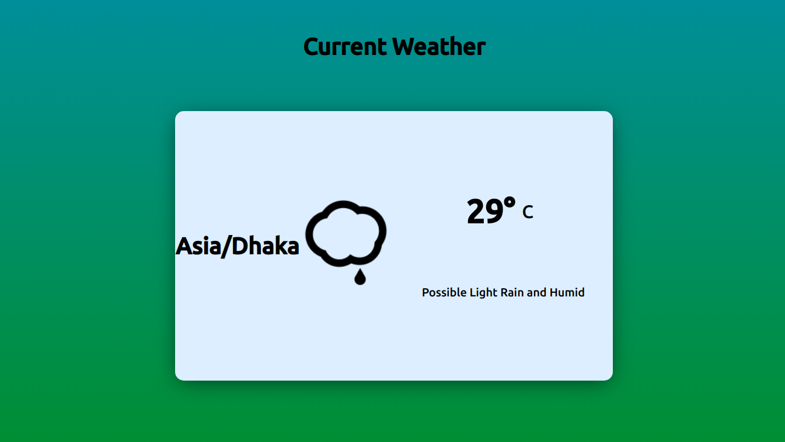
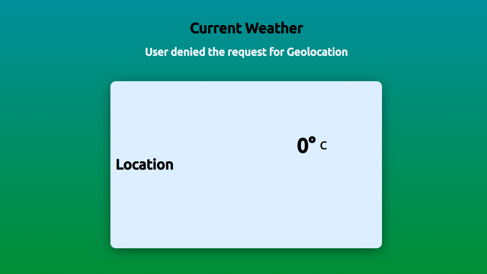

# javascript-weather-app
### This is a simple weather app using javascript.
#### Live On: [view](https://sakilk130.github.io/javascript-weather-app/)
### Screenshot:

 ### Source:
 * [API](https://darksky.net/dev)
 * [w3schools](https://www.w3schools.com/html/html5_geolocation.asp)
 * [Weather-Icon](https://darkskyapp.github.io/skycons/)
 * [GitHub](https://github.com/darkskyapp/skycons)
 * [Font](https://fonts.google.com/specimen/Ubuntu?selection.family=Baloo+Tammudu+2:wght@600|Ubuntu:wght@500)
 * [Icon](https://icons8.com/)
 
